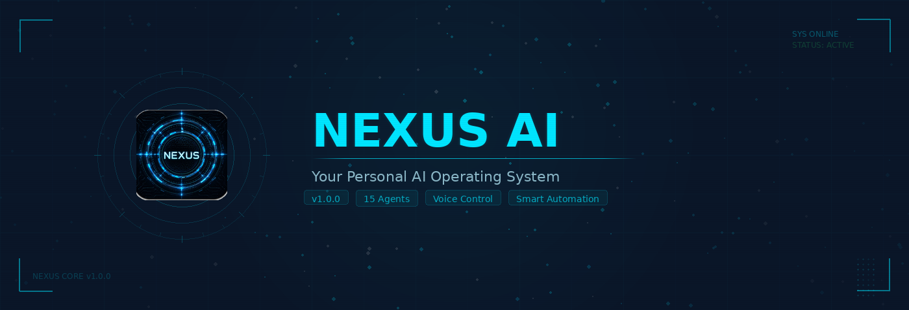
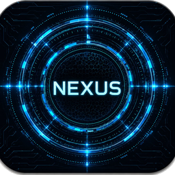

<div align="center">



<br><br>

[](https://drive.google.com/drive/folders/1xfdw0ZcPqJvcyLJKkCnauYkHRvEyRhBA)
&nbsp;&nbsp;&nbsp;
[](https://getnexusai.pro)

<br>


&nbsp;

&nbsp;

&nbsp;


<br>

---

<br>



### Your Personal AI Operating System

*A 15-agent desktop AI platform with voice control, intelligent task routing,*
*and specialized satellite agents — like having a team of AI specialists at your command.*

<br>

</div>

---

<br>

## Key Features

<table>
<tr>
<td width="50%" valign="top">

### Intelligence

**Satellite Agents** — 15 specialized AI agents covering Finance, Research, Writing, HR, Data Analytics, Programming, Productivity, Legal, Travel, Project Management, and more.

**Smart Routing** — A CTO coordinator routes tasks to 6 department leads. A QA Director maintains quality. Cost-aware model routing keeps things efficient.

**Task Automation** — Scheduling, workflow automation, and intelligent routing. Nexus picks the right agent for every request.

</td>
<td width="50%" valign="top">

### Integration

**Voice Control** — Talk to Nexus naturally. Built-in Piper TTS for responses and live microphone input for hands-free operation.

**Email & Calendar** — Full Gmail and Google Calendar integration. Read, compose, search, and schedule — all by voice or text.

**File Management** — Scan, organize, convert, and process documents. PDF, Word, Excel, images, and more.

</td>
</tr>
</table>

<br>

<div align="center">

| | Feature | Description |
|:---:|:---|:---|
| **HUD** | Dark Neon Dashboard | Futuristic command center with cyan and orange accents |
| **Voice** | Natural Speech I/O | Piper TTS engine + live microphone input |
| **Security** | 100% Local Data | API keys stored on your machine, never uploaded |
| **Updates** | Auto-Updater | One-click updates with changelog preview |

</div>

<br>

---

<br>

## System Requirements

<div align="center">

| Component | Requirement |
|:---|:---|
| **Operating System** | Windows 10 or 11 (64-bit) |
| **RAM** | 8 GB minimum |
| **Disk Space** | 2 GB free space |
| **Internet** | Required (for AI model access) |
| **Python** | Not required (bundled in installer) |

</div>

<br>

---

<br>

## Quick Start

```
1.  Download    →  Click the download button above
2.  Install     →  Run NexusAI_Setup_1.0.0.exe
3.  Configure   →  Follow the Setup Wizard (API keys, voice, agent preferences)
4.  Launch      →  Start using Nexus AI with voice or text commands
```

<br>

---

<br>

<div align="center">

### Free Trial

Nexus AI includes a **7-day free trial** — no credit card required.
After the trial, purchase a license key to unlock all features permanently.

<br>

---

<br>

### Support

**Website** &nbsp;→&nbsp; [getnexusai.pro](https://getnexusai.pro)
&nbsp;&nbsp;|&nbsp;&nbsp;
**Email** &nbsp;→&nbsp; [Windelx@yahoo.com](mailto:Windelx@yahoo.com)
&nbsp;&nbsp;|&nbsp;&nbsp;
**Bug Reports** &nbsp;→&nbsp; Built-in button inside Nexus AI

<br>

---

<br>

**Nexus AI** — Your Personal AI Operating System

<sub>© 2026 Nexus AI. All rights reserved.</sub>

</div>
